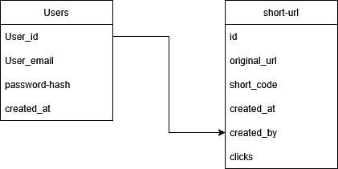

# simple-url-shortener
This is a simple containerized URL shortener application based on production grade URL shortening applications like bitly 
Not deployed yet WIP  
## Architecture
API server : FastAPI  
Database + Read Replica : PostgreSQL   Current schema -
 
Cache : Redis  

## Url generation logic
URL generation is based on Base62 + counter. By using the unique id of each original url, a short url is created.

## Cache Population
Cache will be populated using eager population. The understanding behind this is that urls will be used more after creation. 
For expired URLs lazy population will be used.

## Cache invalidation strategy
Each URL will have TTL = 7 days.

## Work plan
<ul>
<li>Add final APIs</li>
<li>Add NGINX reverse proxy</li>
<li>Grafana for monitnoring</li>
</ul>